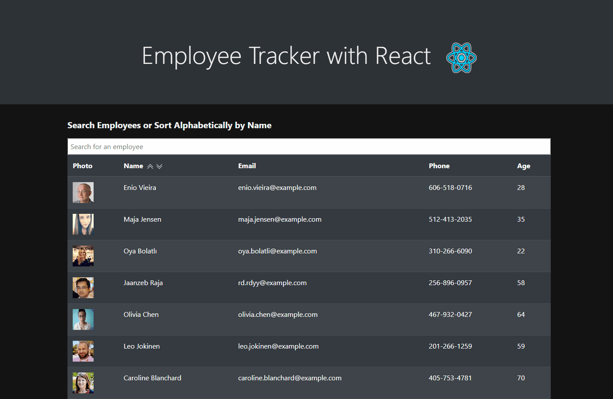

# Employee Tracker with React.js
[](https://www.mit.edu/~amini/LICENSE.md)
<br>
An employee data system built with React. Managers or employees can find non-sensitive data of their employees by name and sort employees alphabetically.

 <br>




<br>

 ## Built With
* React.js
* HTML
* CSS


## Installation
To install dependencies run
```
npm install
```

## Features
Employee list can be sorted alphabetically or can be searched by employee name.
<br>


<br>

## Code Example
The application is tracking the states of the employee data being filtered and sent to the webpage, and the user's search.

<br>  

```javaScript

//create states for employee array and search value
  const [employeeData, setEmployeeData] = useState([])
  const [search, setSearch] = useState("")

```

<br>
<br>

The data is filtered and re-rendered with each change to the "search" state, filtering data live to search input rather than on submit.

<br>  

```javaScript

 //Grab search value on change
  const  handleSearch = (e)=>{
    setSearch(e.target.value)
  }
  
  //render data on each change of search
useEffect(()=>{
  if(search === ""){
    setEmployeeData(Employees)
  }else{
    setEmployeeData(Employees.filter(item=>item.name.toLowerCase().includes(search.toLowerCase())))
  }


},[search])

```

<br>
<br>

Components recieve data from the App.js by using providers to carry values for data, and functions for onClick(sorting alphabetically) and onChange(search input).

<br>  

```javaScript

 //provide values for search/sort functions and employee data to page

  return (
    <SearchContext.Provider value={{search, handleSearch, handleSortA, handleSortZ}}>
      <EmployeeContext.Provider value={{employeeData}}>
        <Page />
      </EmployeeContext.Provider>
    </SearchContext.Provider>
  );
```

<br>


# Deployed Link:
https://joshglugatch.github.io/Team-Avatar-Clicky-Game/

# Repository Link:
https://github.com/joshglugatch/employee-react

<br>

### Author:
Josh Glugatch  

Porfolio Link: https://joshglugatch.herokuapp.com/

[](https://github.com/joshglugatch)
<br>
[](www.linkedin.com/in/joshua-glugatch)


